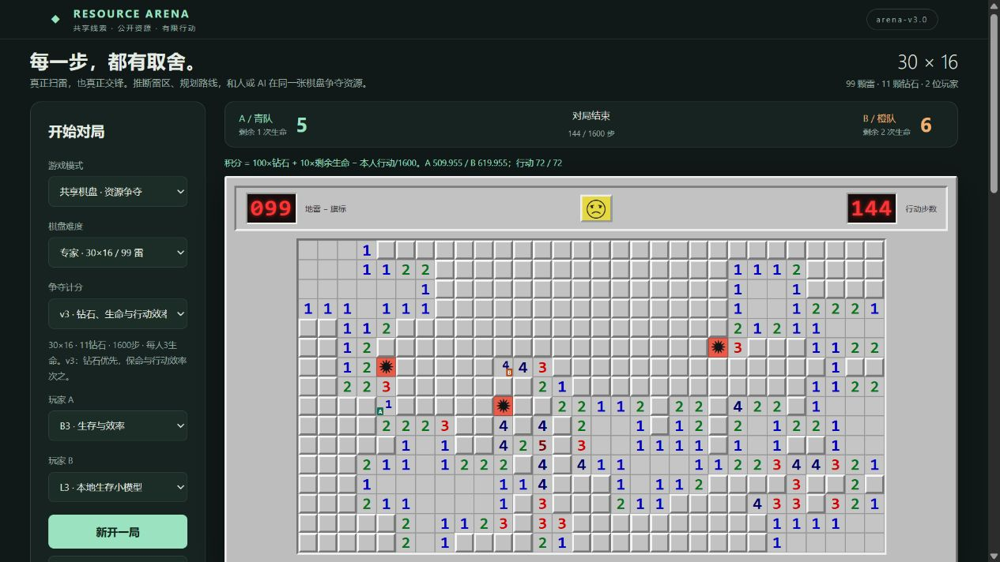

# 扫雷争夺战 · Minesweeper Resource Arena

能用键盘、鼠标与 AI 对战的本地浏览器游戏，以及可复核的双智能体决策实验。两位参与者在**同一张隐藏雷图**上争夺公开安全钻石，使用公共线索推断风险，并选择继续争夺或转向其他资源。

研究范围限于自建仿真游戏与教学。没有连接第三方排行榜、读取商业游戏内存或使用真实排雷设备。课程模拟专利写作不表示已获专利，也没有完成新颖性检索或证明算法原创性。



截图来自实际程序。浏览器验证由自动化操作完成，**真实人类玩家数据为 0**；截图与操作证据见[新版浏览器验收](docs/browser_validation_v3.md)。

## 在 Windows 启动

已在 Windows、Python 3.12 与本机浏览器实际运行。安装 Python 3.10 或更新版本并加入 PATH，然后双击 `start.bat`。首次启动按需安装 NumPy，并打开本地页面。也可以在仓库目录执行：

```powershell
python -m pip install -r requirements.txt
python -m arena.server
```

打开[本机游戏](http://127.0.0.1:8765)。服务只绑定 `127.0.0.1`，不使用付费 API、外部遥测或云 GPU。端口占用时运行 `python -m arena.server --port 8766`。停止服务按 Ctrl+C。其他系统尚未完成同等浏览器验收。

选择共享棋盘和难度，将 A 设为人工、B 设为 B3 或 L3，再新开一局。默认进入16×16进阶生存计分模式；专家模式为30列×16行。方向键、WASD、方向按钮或相邻格点击可移动，空格等待，右键做旗标。双方设为人工可本机轮流对战，双方设为 AI 可观察自动对局。L3 读取生存模型 `models/survival_v3_final.npz`，C1 读取经典模型 `models/classic_v3_final.npz`。L2 读取大棋盘模型 `models/challenge_final.npz`；L1 是原9×9模型，读取 `models/L_final.npz`。两者跨规则使用会明确标为分布外。权重缺失明确报错，不回退规则策略冒充学习。

界面提供经典模式、暂停、AI 单步、速度调整、风险热图、实际策略输出、公开对局导出/导入、回放滑块及本机快照分支。旗标只作标记，不进入推断事实。详见[安装与使用](docs/usage.md)。

## 难度与三种玩法

| 档位 | 棋盘 | 地雷 | 共享争夺资源 / 生命 / 总步数上限 |
|---|---:|---:|---|
| 原始实验 v1 / 入门争夺 | 9×9 | 10 | 3钻石 / 每人1次 / 200 |
| 进阶挑战 v2 | 16×16 | 40 | 7钻石 / 每人3次 / 800 |
| 专家挑战 v2 | 30×16 | 99 | 11钻石 / 每人3次 / 1600 |

**经典模式**：揭开所有安全格获胜，右键插旗，点击已揭数字可在旗数匹配时连开。入门、进阶、专家预设支持首次揭格及其八邻格安全、零区展开；不保证无猜。原始实验档保留早期固定雷位、首击可能失败的规则。终局才显示地雷。

**共享争夺模式**：两人共享线索，轮流上下左右走一格或等待，实际到达钻石格才得分。默认v3终局按钻石、剩余生命、较少本人行动依次比较，v2选项保留仅比钻石数。v2两角3×3区域和钻石公开安全，零区展开；踩雷扣生命，尚有生命就回到自己的起点，耗尽才淘汰。雷位生成后固定，不会为延长对局移雷。起点附近不放资源的距离限制是明确公布的生成规则，不是按胜率筛地图。

两版均保留失败、不可达资源、平局与超时。未知雷不会被从合法动作中偷偷剔除；未揭雷图和生成种子不传给策略。新增生命、复活、钻石和移动规则是本项目变体，不是 Windows 经典规则。

“观看 AI 对打”在争夺模式开始 B3 对 L3，在经典竞速模式开始 R1 对 C1；也可分别选择其他策略。难度更大不自动代表算法更有价值：需比较同图换座和先手条件下的表现、策略分歧、失败类型及计算成本。

规则与许可见[来源调研](docs/research.md)、[v1冻结规则](docs/rules.md)、[v2冻结规则](docs/rules_v2.md)、[v3计分与边界](docs/rules_v3.md)。

## 新版计分与自己的小模型

争夺积分为 `100×钻石 + 10×剩余生命 − 本人行动/总步数上限`；实现用等价整数比较。钻石优先，同钻保命，同命减少行动；不按设备速度或动画时间判输赢。B3进一步按3/2/1生命采用8/18/72的风险权重，结合近期重复位置与对手路线；L3模仿B3。公式不会保证AI永不冒险，计分、启发式与学习模型分别验收。

**经典同图AI竞速**是辅助模式：相同雷图和保护首击、双方独立观察，交替揭格。主研究仍是共享资源争夺。C1从实际揭格反馈训练，网络10→16→1，共193参数；L3为40→48→1，共2017参数。本地CPU即可训练/运行，**不需要API，也没有部署外部大语言模型**。路线说明见[模型选择](docs/model_choice.md)。

|新实验|真实完成与结果|限制|
|---|---|---|
|经典 C1|42张基础图；410训练+144验证反馈；144场留出竞速。通关C1 88/96，R1 96/96|仅12张独立测试图，9×9训练；C1较少点击不等于更可靠|
|生存 L3|44张基础图；5597训练、1761验证、2920纠偏特征；240正式局。对B2中级8/24胜，专家16/24胜|每档6张测试图；中级保命更多但资源更少；补训未提高胜率|
|公开数据核验|经典174局3338动作、生存352局完整重放；全部选中标签/特征重建通过；公开NPZ独立复训L3两轮模型哈希一致|仿真数据，真人样本为0；教师不是最优解，实际结果不是精确概率|

240场生存测试没有平局或超时，也没有一场因生命/行动次级分改变钻石胜负，因此不能宣称本批实验已证明新计分改变结果。不同规则的成绩分别保存，全部失败与负结果保留。详细报告与复现命令：[经典竞速](docs/classic_race.md)、[生存模型](docs/survival_v3.md)。

## 2026年10月1日继续训练

在同一规则和网络结构下，扩充到72张训练图、24张验证图、40张全新测试图。使用15,934条训练样本和5,860条验证样本，完成3次独立随机初始化训练，每次45轮；不是连续承接前一次权重。各候选320测试局，旧L3另跑320局作为共同对照，共1,280局，全部保留。

|策略|同图胜 / 平 / 负|胜率|
|---|---:|---:|
|旧L3|161 / 0 / 159|50.31%|
|本批第1次训练|165 / 0 / 155|51.56%|
|本批第2次训练|162 / 0 / 158|50.63%|
|本批第3次训练|163 / 0 / 157|50.94%|

测试前按最低验证交叉熵提名第2次训练，未根据测试成绩改选第1次。提名模型相对旧L3仅多1胜，各难度和对手的地图配对区间均包含0，尚不能确认稳定提升；游戏默认权重仍为旧L3。正式测试没有平局或超时，训练采集中的1平局和4超时单列保留。更多资源、生命和行动指标、三份独立结果记录以及全部权重和数据见[本批完整结果](experiments/l3-expanded-20261001/summary.md)。后续可按[批次训练说明](docs/training_batches.md)建立新的独立实验与结果记录。

## 大棋盘训练与可用数据

大棋盘模型 L2 为 **32→48→1、1,633 参数**动作评分网络，结合公开约束风险和路径特征。网络只接收公开预选的3个资源槽，规则基线仍比较全部7/11个资源。它不是读取画面的通用大模型，也不访问隐藏雷图。

新数据、模型和评测与旧版分开保存，详见[大棋盘实验及数据说明](docs/challenge_v2_experiments.md)。逐步记录可用于监督模仿和离线策略研究；教师动作不等于最优动作，一次踩雷结果不等于精确概率，最终胜负也不等于每一步的正确标签。实际模型、训练日志、地图分区、完整轨迹和独立回放核验共同构成交付证据。

## 自主探索：先观察，再验证

另有独立的 **E策略**：8参数线性动作评分器，通过CEM搜索参数并随机探索动作，从终局胜负和钻石差得到反馈；不使用教师动作标签。训练对手包含B1、B2和历史版本。它仍依赖人工编写的公开风险与路径特征，属于这个策略族内的探索，不是从零发现任意算法。

真实完成4代、32候选、256搜索局与40验证局，再以4张新地图做初始/最终参数的64局配对测试。初始与最终均为0胜4平28负（各32局），没有发现稳定的新优势。等待、绕行、切换等事件保存为候选现象，不能当作有效策略或涌现智能的证明。完整参数、失败、超时、轨迹和审计见[自主探索实验](docs/exploration.md)。选择界面中的“E · 自主探索（16×16）”可实际对战；专家棋盘属于它的分布外条件。

## 原始9×9实验：策略与真实训练

| 策略 | 实际实现 |
|---|---|
| B0 | 随机合法动作 |
| B1 | 风险感知的路径启发式，不使用显式对手状态 |
| B2 | 共用风险模块，并加入对手位置与到达代价的竞争项 |
| L_initial | B2 教师监督模仿训练的 27→32→1 动作评分网络，929 参数 |
| L | 在训练集失败/分歧局面上完成一轮纠正训练的同一网络 |
| L_no_opponent | 相同样本、架构、种子与预算，去掉显式对手特征的消融 |

风险模块执行约束推断、小组件模型计数与全局雷数加权；超预算明确标为 `approximate_cutoff`。加性路径代价不是精确的整条路径存活概率。学习策略显示真实 logit，其目标仅为动作的事后路线归因，没有显式目标头。

以下数字仅属于 **arena-v1.0 的9×9实验**，不表示新版大棋盘结果。重新采集并训练：200 张训练图、400 局得到 **5,722 条**去重教师状态；另 30 张验证图得到 **891 条**状态。初训 45 轮、1,035 次优化更新。训练图上的纠正轮包含 166 个输局、342 次动作分歧，按冻结判据选出 **3,217 条**状态，与原数据拼接为 **8,939 条**样本，训练 20 轮、700 次更新。两轮之间可能重复，拼接数不称为跨轮唯一状态。

固定训练预算内按**验证交叉熵最低**保存检查点，本次分别选中第 45 轮和第 20 轮；最终验证教师动作准确率 94.05%。准确率只衡量模仿教师，不是胜率或最优性。只有一个训练随机种子，未检验跨训练种子稳定性。

最终权重 SHA256：`0a3649d98d8ff3905b0629d8b5286e127dd96e8f5af25602e8feb0d49631807d`。每轮损失、耗时、预算、选型和哈希保存在 `models/*_training.json`。这是监督模仿与纠正训练，**没有进行强化学习**。

## 原始9×9实验：实测结果与负结果

初测 100 张留出图、1,200 局；独立复测另 100 图、2,800 局；随机 B0 对手测试另 100 图、1,200 局。合计 **300 张独立测试图、5,200 正式局**。每策略对每图交换起点座位及先行动者，共 4 条件；这些条件不算独立地图。

下表每行 400 局、100 张基础图。“胜+半平”只作分析，游戏仍只按钻石判胜负。区间以基础图为单位重采样 2,000 次。

| 阶段与策略 / 对手 | 胜 / 平 / 负 | 胜+半平 | 95% 基础图区间 |
|---|---:|---:|---:|
| 独立复测 B2 / B1 | 196 / 12 / 192 | 50.500% | 50.000%–51.250% |
| 独立复测 L / B1 | 188 / 11 / 201 | 48.375% | 46.250%–50.125% |
| 独立复测 L / B2 | 187 / 11 / 202 | 48.125% | 46.000%–49.875% |
| 独立复测 L_no_opponent / B2 | 186 / 14 / 200 | 48.250% | 46.500%–50.000% |
| 随机对手测试 L / B0 | 279 / 84 / 37 | 80.250% | 76.122%–83.875% |

**本轮未得到学习策略优于启发式、补训提高对战成绩或对手特征带来可靠收益的证据。** L 相对 L_initial 对 B1、B2 的胜+半平均下降 0.125 个百分点，配对区间分别为 −2.750 至 +2.250、−2.750 至 +2.375 个百分点。L 相对匹配消融也是 −0.125 个百分点，区间为 −2.125 至 +1.750。均保留原结果，不按测试成绩挑权重或地图。

5,200 局中保留 **480 平局、1 个 200 步超时**。99,919 次决策包含 99,822 次完整全局计数与 **97 次近似截断**。真实失败例中，L 以 2/3 推断风险进入未知格并踩雷，最终 0:3 落败；这一次雷位结果不被当成概率标签。争夺、目标切换和算法分歧案例均有完整公开回放，但不构成主观意图或最优性证明。

详见[完整实验报告](docs/experiments.md)、[初测](data/evaluation/initial/summary.json)、[复测](data/evaluation/retest/summary.json)、[随机对手测试](data/evaluation/random/summary.json)、[配对比较](data/evaluation/retest/paired_effects.json)与[案例核验](docs/case_review.md)。原始逐局 CSV、失败与超时回放均随仓库保存。

## 复现与核验

本地测试覆盖原始规则、大棋盘规则、风险推断、策略、服务器接口和回放格式。最终执行数及日志见[验收表](docs/acceptance.md)：

```powershell
python -m unittest discover -s tests -v
node tests/test_replay.js
```

5,200 正式局全部逐动作重放，并由独立 audit 入口再次核对。另从 860 局公开教师、验证和纠正轨迹重新构造全部特征、动作掩码和教师标签，与三份 NPZ 逐元素一致。200 训练、30 验证及 300 测试共 **530 张基础图**经旋转/镜像规范化后无重复。模型文件哈希、验证最优检查点和公开字段隔离检查均通过，见[完整性审计](data/final_integrity_audit.json)。

生成种子与隐藏雷图保存在**仓库外私人目录**，公开协议只记录数量和私有清单哈希；策略不能读取种子。公共回放可直接在网页查看。精确重演本次隐藏环境需要私人交付中的 manifest；从公开克隆可以运行同方法、同规模的全新实验，使用独立输出目录保护已有成果：

```powershell
$env:ARENA_OUTPUT_DIR = Join-Path (Get-Location) 'runs/fresh'
$env:ARENA_PRIVATE_DIR = Join-Path (Split-Path (Get-Location)) 'arena-private-fresh'
python -m arena.learning initial
python -m arena.experiment initial --limit 5
python -m arena.experiment initial
python -m arena.learning refine
python -m arena.experiment retest
python -m arena.experiment random
python -m arena.analyze
python -m arena.audit
```

新地图不会逐数复现本报告；确需本次地图时使用私人清单与新的输出目录。协议不同会报错，不能悄悄覆盖。训练与正式评测配置见 `data/protocol.json`，复现限制见[数据说明](docs/data.md)。可设置 `OPENBLAS_NUM_THREADS=1`、`OMP_NUM_THREADS=1` 控制小矩阵并行开销；不同 NumPy/BLAS 可能产生细小浮点与动作差异。

浏览器的人机输入、模型加载、暂停/单步、重置、快照、导出导入和截图验证以[本轮浏览器验收](docs/browser_validation.md)为准；自动化操作不计为真人数据。完整状态见[验收表](docs/acceptance.md)。GitHub Actions 已配置；本地通过不代表远端 CI 已通过，发布与远端运行状态以实际读回结果为准。

## 代码、数据与许可

- `arena/env.py`、`classic.py`：权威规则与公共观察；`server.py`、`web/`：本机界面。
- `arena/risk.py`、`policies.py`：风险与策略；`learning.py`、`experiment.py`：训练与评测。
- `arena/analyze.py`、`audit.py`、`report.py`：案例、完整性检查与基于日志生成的报告。
- `models/`、`data/`：本项目实际权重、合成程序轨迹、特征、公开协议与实验结果。
- `tests/`、`config/`、`docs/`：测试、冻结规则、方法与使用说明及真实截图。

自产源码、公开文档、合成对局数据及本项目训练权重按 [MIT](LICENSE) 提供；没有外部预训练模型或外部训练数据。NumPy 使用 BSD-3-Clause，Python 运行时遵循 PSF 许可；参考项目及借鉴边界见[第三方说明](THIRD_PARTY_NOTICES.md)。不打包系统字体、商业素材、教师原始资料、私人课程报告或未经许可的玩家记录。

当前局限：旧实验仅一个训练随机种子；本批增加到3次独立初始化，但共享同一数据分区。没有真实玩家数据、强化学习、多人联机、十人版本或硬件实验。启发式及学习策略均会失败，本次结果不证明普遍优势或专利新颖性。详见[算法](docs/algorithms.md)、[架构](docs/architecture.md)与[数据说明](docs/data.md)。
