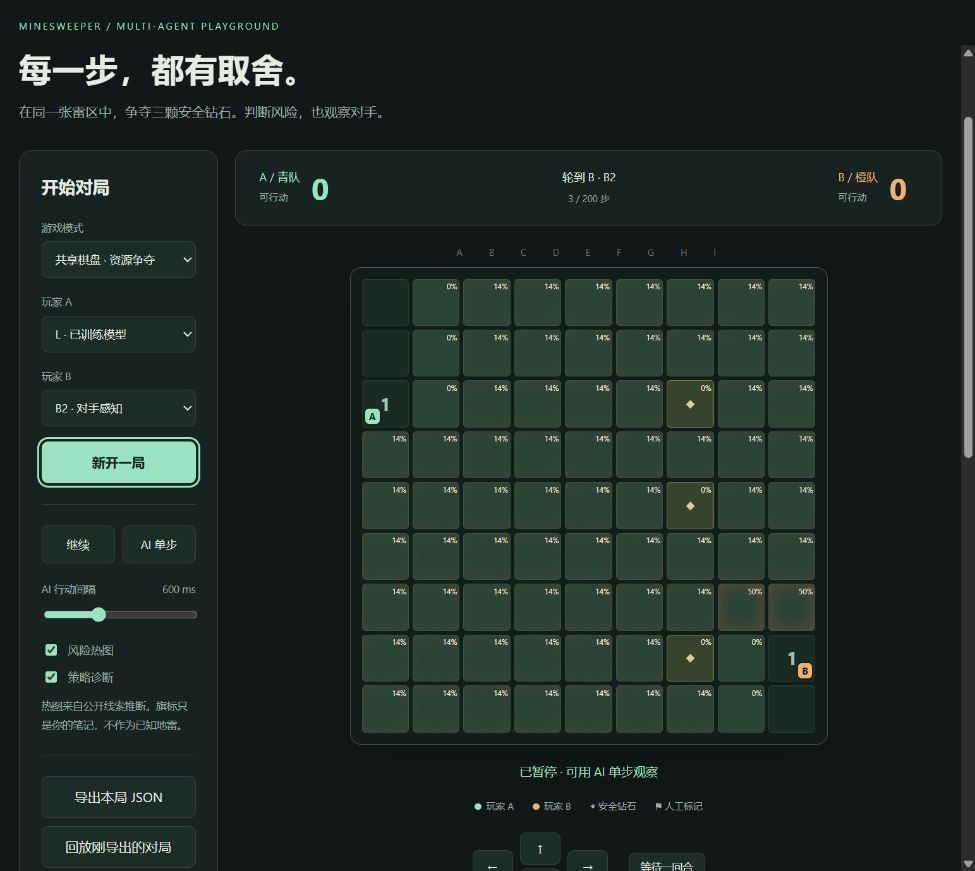

# 扫雷争夺战 · Minesweeper Resource Arena

能用键盘、鼠标与 AI 对战的本地浏览器游戏，以及可复核的双智能体决策实验。两位参与者在**同一张隐藏雷图**上争夺公开安全钻石，使用公共线索推断风险，并选择继续争夺或转向其他资源。

研究范围限于自建仿真游戏与教学。没有连接第三方排行榜、读取商业游戏内存或使用真实排雷设备。课程模拟专利写作不表示已获专利，也没有完成新颖性检索或证明算法原创性。



截图来自实际程序。浏览器验证由自动化操作完成，**真实人类玩家数据为 0**；截图与操作证据见[本轮浏览器验收](docs/browser_validation.md)。

## 在 Windows 启动

已在 Windows、Python 3.12 与本机浏览器实际运行。安装 Python 3.10 或更新版本并加入 PATH，然后双击 `start.bat`。首次启动按需安装 NumPy，并打开本地页面。也可以在仓库目录执行：

```powershell
python -m pip install -r requirements.txt
python -m arena.server
```

打开[本机游戏](http://127.0.0.1:8765)。服务只绑定 `127.0.0.1`，不使用付费 API、外部遥测或云 GPU。端口占用时运行 `python -m arena.server --port 8766`。停止服务按 Ctrl+C。其他系统尚未完成同等浏览器验收。

选择共享棋盘，将 A 设为人工、B 设为 B2 或 L，再新开一局。方向键、WASD、方向按钮或相邻格点击可移动，空格等待，右键做旗标。双方设为人工可本机轮流对战，双方设为 AI 可观察自动对局。L 读取 `models/L_final.npz`，权重缺失明确报错，不回退规则策略冒充学习。

界面提供经典模式、暂停、AI 单步、速度调整、风险热图、实际策略输出、公开对局导出/导入、回放滑块及本机快照分支。旗标只作标记，不进入推断事实。详见[安装与使用](docs/usage.md)。

## 两种模式的规则

| 内容 | 经典扫雷 | 资源争夺变体 `arena-v1.0` |
|---|---|---|
| 棋盘与数字 | 9×9、10 雷、八邻域雷数 | 相同雷数及数字含义 |
| 行动 | 鼠标揭格、插旗、零区展开 | 双方轮流上下左右移动一格或等待；无零区展开 |
| 安全条件 | 固定雷位，首点可能踩雷 | 两起点和 3 个公开钻石格必定安全 |
| 信息 | 已揭数字与旗标 | 双方位置、分数、存活、资源和线索共享 |
| 踩雷 | 本局失败 | 当前玩家淘汰，已有得分保留，对手继续 |
| 胜负 | 揭完全部安全格获胜 | 先到钻石得 1 分，终局只比较钻石数量 |
| 终局 | 胜利或踩雷 | 钻石取完、双方淘汰或总计 200 步；同分平局 |

起点为两个对角，钻石不与起点重叠；先均匀选钻石，再从其余格均匀放固定雷。不筛除不可达或不利地图。未知雷位不会从合法动作中被偷偷剔除。已淘汰的领先者仍可能按分数获胜，这是冻结规则允许的结果。

规则来源、变体差异与许可见[短调研](docs/research.md)、[规则说明](docs/rules.md)与[规则审查](docs/rule_audit.md)。

## 策略与真实训练

| 策略 | 实际实现 |
|---|---|
| B0 | 随机合法动作 |
| B1 | 风险感知的路径启发式，不使用显式对手状态 |
| B2 | 共用风险模块，并加入对手位置与到达代价的竞争项 |
| L_initial | B2 教师监督模仿训练的 27→32→1 动作评分网络，929 参数 |
| L | 在训练集失败/分歧局面上完成一轮纠正训练的同一网络 |
| L_no_opponent | 相同样本、架构、种子与预算，去掉显式对手特征的消融 |

风险模块执行约束推断、小组件模型计数与全局雷数加权；超预算明确标为 `approximate_cutoff`。加性路径代价不是精确的整条路径存活概率。学习策略显示真实 logit，其目标仅为动作的事后路线归因，没有显式目标头。

本轮重新采集并训练：200 张训练图、400 局得到 **5,722 条**去重教师状态；另 30 张验证图得到 **891 条**状态。初训 45 轮、1,035 次优化更新。训练图上的纠正轮包含 166 个输局、342 次动作分歧，按冻结判据选出 **3,217 条**状态，与原数据拼接为 **8,939 条**样本，训练 20 轮、700 次更新。两轮之间可能重复，拼接数不称为跨轮唯一状态。

固定训练预算内按**验证交叉熵最低**保存检查点，本次分别选中第 45 轮和第 20 轮；最终验证教师动作准确率 94.05%。准确率只衡量模仿教师，不是胜率或最优性。只有一个训练随机种子，未检验跨训练种子稳定性。

最终权重 SHA256：`0a3649d98d8ff3905b0629d8b5286e127dd96e8f5af25602e8feb0d49631807d`。每轮损失、耗时、预算、选型和哈希保存在 `models/*_training.json`。这是监督模仿与纠正训练，**没有进行强化学习**。

## 本轮实测结果与负结果

初测 100 张留出图、1,200 局；独立复测另 100 图、2,800 局；随机 B0 对手测试另 100 图、1,200 局。合计 **300 张独立测试图、5,200 正式局**。每策略对每图交换起点座位及先行动者，共 4 条件；这些条件不算独立地图。

下表每行 400 局、100 张基础图。“胜+半平”只作分析，游戏仍只按钻石判胜负。区间以基础图为单位重采样 2,000 次。

| 阶段与策略 / 对手 | 胜 / 平 / 负 | 胜+半平 | 95% 基础图区间 |
|---|---:|---:|---:|
| 独立复测 B2 / B1 | 196 / 12 / 192 | 50.500% | 50.000%–51.250% |
| 独立复测 L / B1 | 188 / 11 / 201 | 48.375% | 46.250%–50.125% |
| 独立复测 L / B2 | 187 / 11 / 202 | 48.125% | 46.000%–49.875% |
| 独立复测 L_no_opponent / B2 | 186 / 14 / 200 | 48.250% | 46.500%–50.000% |
| 随机对手测试 L / B0 | 279 / 84 / 37 | 80.250% | 76.122%–83.875% |

**本轮未得到学习策略优于启发式、补训提高对战成绩或对手特征带来可靠收益的证据。** L 相对 L_initial 对 B1、B2 的胜+半平均下降 0.125 个百分点，配对区间分别为 −2.750 至 +2.250、−2.750 至 +2.375 个百分点。L 相对匹配消融也是 −0.125 个百分点，区间为 −2.125 至 +1.750。均保留原结果，不按测试成绩挑权重或地图。

5,200 局中保留 **480 平局、1 个 200 步超时**。99,919 次决策包含 99,822 次完整全局计数与 **97 次近似截断**。真实失败例中，L 以 2/3 推断风险进入未知格并踩雷，最终 0:3 落败；这一次雷位结果不被当成概率标签。争夺、目标切换和算法分歧案例均有完整公开回放，但不构成主观意图或最优性证明。

详见[完整实验报告](docs/experiments.md)、[初测](data/evaluation/initial/summary.json)、[复测](data/evaluation/retest/summary.json)、[随机对手测试](data/evaluation/random/summary.json)、[配对比较](data/evaluation/retest/paired_effects.json)与[案例核验](docs/case_review.md)。原始逐局 CSV、失败与超时回放均随仓库保存。

## 复现与核验

本地已运行通过 **52 项 Python 单元/接口测试**，以及 Node 回放验证（合法格式与 11 种畸形输入）：

```powershell
python -m unittest discover -s tests -v
node tests/test_replay.js
```

5,200 正式局全部逐动作重放，并由独立 audit 入口再次核对。另从 860 局公开教师、验证和纠正轨迹重新构造全部特征、动作掩码和教师标签，与三份 NPZ 逐元素一致。200 训练、30 验证及 300 测试共 **530 张基础图**经旋转/镜像规范化后无重复。模型文件哈希、验证最优检查点和公开字段隔离检查均通过，见[完整性审计](data/final_integrity_audit.json)。

生成种子与隐藏雷图保存在**仓库外私人目录**，公开协议只记录数量和私有清单哈希；策略不能读取种子。公共回放可直接在网页查看。精确重演本次隐藏环境需要私人交付中的 manifest；从公开克隆可以运行同方法、同规模的全新实验，使用独立输出目录保护已有成果：

```powershell
$env:ARENA_OUTPUT_DIR = Join-Path (Get-Location) 'runs/fresh'
$env:ARENA_PRIVATE_DIR = Join-Path (Split-Path (Get-Location)) 'arena-private-fresh'
python -m arena.learning initial
python -m arena.experiment initial --limit 5
python -m arena.experiment initial
python -m arena.learning refine
python -m arena.experiment retest
python -m arena.experiment random
python -m arena.analyze
python -m arena.audit
```

新地图不会逐数复现本报告；确需本次地图时使用私人清单与新的输出目录。协议不同会报错，不能悄悄覆盖。训练与正式评测配置见 `data/protocol.json`，复现限制见[数据说明](docs/data.md)。可设置 `OPENBLAS_NUM_THREADS=1`、`OMP_NUM_THREADS=1` 控制小矩阵并行开销；不同 NumPy/BLAS 可能产生细小浮点与动作差异。

浏览器的人机输入、模型加载、暂停/单步、重置、快照、导出导入和截图验证以[本轮浏览器验收](docs/browser_validation.md)为准；自动化操作不计为真人数据。完整状态见[验收表](docs/acceptance.md)。GitHub Actions 已配置；本地通过不代表远端 CI 已通过，发布与远端运行状态以实际读回结果为准。

## 代码、数据与许可

- `arena/env.py`、`classic.py`：权威规则与公共观察；`server.py`、`web/`：本机界面。
- `arena/risk.py`、`policies.py`：风险与策略；`learning.py`、`experiment.py`：训练与评测。
- `arena/analyze.py`、`audit.py`、`report.py`：案例、完整性检查与基于日志生成的报告。
- `models/`、`data/`：本项目实际权重、合成程序轨迹、特征、公开协议与实验结果。
- `tests/`、`config/`、`docs/`：测试、冻结规则、方法与使用说明及真实截图。

自产源码、公开文档、合成对局数据及本项目训练权重按 [MIT](LICENSE) 提供；没有外部预训练模型或外部训练数据。NumPy 使用 BSD-3-Clause，Python 运行时遵循 PSF 许可；参考项目及借鉴边界见[第三方说明](THIRD_PARTY_NOTICES.md)。不打包系统字体、商业素材、教师原始资料、私人课程报告或未经许可的玩家记录。

当前局限：一个训练随机种子；没有真实玩家数据、强化学习、多人联机、十人版本或硬件实验。启发式及学习策略均会失败，本次结果不证明普遍优势或专利新颖性。详见[算法](docs/algorithms.md)、[架构](docs/architecture.md)与[数据说明](docs/data.md)。
